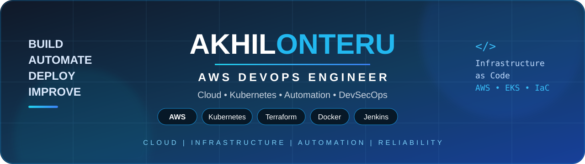

<div align="center">



# A K H I L  O N T E R U

### **AWS DevOps Engineer • Cloud • Kubernetes • Automation**

`AWS` `Terraform` `Kubernetes` `Docker` `Jenkins` `Helm` `DevSecOps`

*Automate infrastructure. Ship reliably. Troubleshoot with evidence.*

[](https://github.com/akhilonteru)
[](https://www.linkedin.com/in/akhilonteru/)
[](https://aws.amazon.com/)

</div>

---

<h2><b>👋 About Me</b></h2>

AWS DevOps Engineer with **3.6+ years of hands-on experience** in AWS, Terraform, Docker, Kubernetes/EKS, CI/CD and DevSecOps.

I build **automated infrastructure, delivery pipelines and practical troubleshooting solutions**.

---

<h2><b>📊 GitHub Statistics</b></h2>

<div align="center">


<br>


</div>

---

<h2><b>⚡ Tech Stack</b></h2>

**☁️ Cloud** — AWS • EC2 • VPC • EKS • IAM • S3 • RDS • Route 53 • ALB • CloudWatch

**🏗️ IaC** — Terraform • Modules • State

**☸️ Platform** — Docker • Kubernetes • EKS • Helm

**🔄 CI/CD** — Jenkins • GitHub • GitLab CI/CD • Azure DevOps • Maven

**🔐 Security** — SonarQube • SonarCloud • Trivy • Nexus • JFrog

**📈 Monitoring** — CloudWatch • Prometheus • Grafana

**🐧 Automation** — Linux • Bash • Python • PowerShell • Ansible

---

<h2><b>🧠 Current Focus</b></h2>

`AWS Architecture` • `Advanced Kubernetes` • `Terraform` • `GitOps`

`CI/CD` • `DevSecOps` • `Observability` • `Production RCA`

---

<h2><b>📂 Featured Projects</b></h2>

<div align="center">

### 🔧 DevOps & Infrastructure

| Repository | Focus |
|---|---|
| 📚 [**DevOps Cheat Sheets**](https://github.com/akhilonteru/devops-cheat-sheets) | Commands & troubleshooting |
| 🧪 [**DevOps Learning Repository**](https://github.com/akhilonteru/devops-learning-repo) | Hands-on DevOps learning |

### ☁️ AWS & Cloud

`AWS` • `VPC` • `EC2` • `EKS` • `IAM` • `S3` • `RDS` • `Route 53`

### ☸️ Kubernetes & EKS

`Docker` → `Kubernetes` → `EKS` → `Helm` → `CI/CD`

### 🔄 CI/CD & DevSecOps

`Jenkins` • `Maven` • `SonarQube` • `Trivy` • `Docker` • `Kubernetes`

</div>

---

<h2><b>🚀 Areas of Expertise</b></h2>

<table align="center">
<tr>
<td>☁️ Cloud Infrastructure</td>
<td>☸️ Kubernetes / EKS</td>
<td>🏗️ Terraform / IaC</td>
<td>🐳 Docker</td>
</tr>

<tr>
<td>🔄 CI/CD</td>
<td>🔐 DevSecOps</td>
<td>📊 Observability</td>
<td>🐧 Linux</td>
</tr>

<tr>
<td>🌐 Networking</td>
<td>🔎 DNS</td>
<td>🔧 Troubleshooting</td>
<td>🚨 Root Cause Analysis</td>
</tr>
</table>

---

<h2><b>🌐 Learning Hub</b></h2>

<div align="center">

| Resource | Focus |
|---|---|
| ☁️ AWS | Cloud & infrastructure |
| ☸️ Kubernetes | EKS & troubleshooting |
| 🏗️ Terraform | Infrastructure as Code |
| 🔄 CI/CD | Jenkins & automation |
| 🔐 DevSecOps | SonarQube & Trivy |
| 🔗 GitOps | Declarative delivery |
| 📊 Observability | Metrics, logs & RCA |
| 🌐 Multi-Cloud | Azure DevOps |

</div>

---

<h2><b>🔧 Real-World Troubleshooting</b></h2>

**Kubernetes** — `Pending` • `CrashLoopBackOff` • `ImagePullBackOff` • `Scheduling` • `DNS`

**Docker** — `Builds` • `Images` • `Containers` • `Permissions` • `Networking`

**AWS** — `EC2` • `EKS` • `IAM` • `Security Groups` • `DNS` • `RDS`

**CI/CD** — `Agents` • `Java/Maven` • `Builds` • `Quality Gates` • `Deployments`

**Linux** — `CPU` • `Memory` • `Disk` • `Ports` • `Processes` • `Logs`

```text
Symptom → Evidence → Root Cause → Fix → Verify → Prevent
